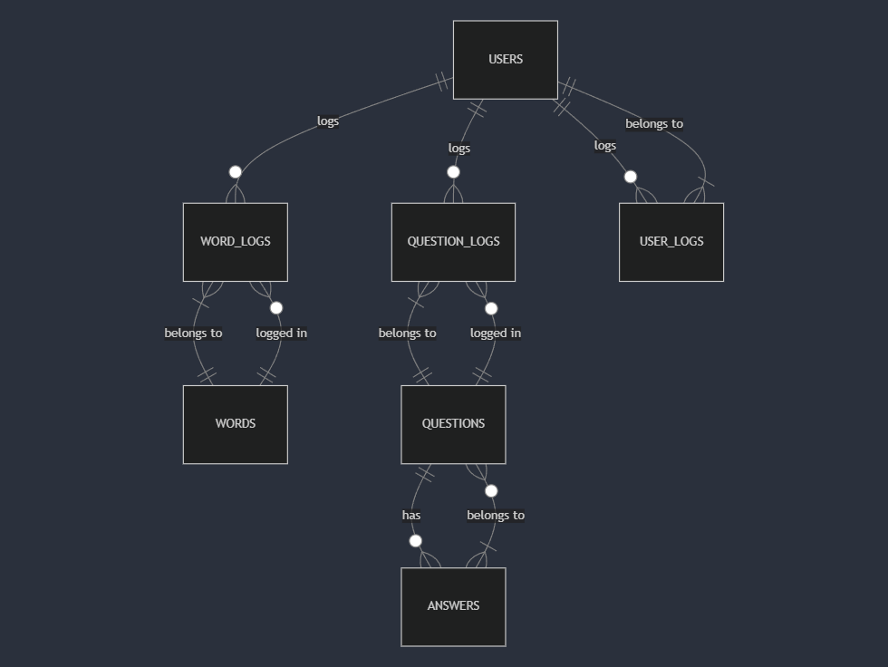

# Design Document

By Faris Ahmad

Video overview:

## Scope

This database includes all the entities necessary to create a very basic Lithuanian language learning app. This database will keep track of all the new words and questions added to it with translation and sentence examples. This database will be the structure of a Language learning app that I'm going to build in Future that's why it contains a Users tables as well

* Users, including basic identifying information for users
* Words, including the information about the lithuanian words
* Questions, including some questions to test
* Answers, including answers to those questions
* Word_Logs, Logs all the words added or deleted from the Words table
* Question_Logs, Logs all the questions added or deleted from the Questions table
* User_Logs, Logs all the users who signed up or deleted their accounts

## Functional Requirements

This database will support:

* CRUD operations for Users and Vocab
* Tracking all the words, questions, users

## Representation

Entities are captured in MYSQL tables with the following schema

### Entities

The database include the following entities:

#### Users

The `Users` table includes:

* `id`, which specifies the uniques ID for the User as an `INT`. This column thus has the `PRIMARY KEY` constraint applied.
* `first_name`, which specifies the users's first name as `VARCHAR(32)`, given `VARCHAR(32)` is appropriate for name fields.
* `last_name`, which specifies the users's first name as `VARCHAR(32)`, given `VARCHAR(32)` is appropriate for name fields.
* `username`, which specifies the user's username. `VARCHAR(32)` is used for the same reason as `first_name`. A `UNIQUE` constraint ensures no two students have the same GitHub username.
* `proficieny_level`, which specifies the user's proficiency level in the language as `ENUM`, given `ENUM` is approptiate for fields with only certain values

The `Words` include:

* `id`, Specifies the unique ID for the word as an INT. This column has the * PRIMARY KEY constraint applied.
* `word`, Specifies the word being learned as a VARCHAR(100), given that most words will fit within this length.
* `translation` Specifies the translation of the word as a VARCHAR(100), since translations are typically short.
* `sentence`, Stores an example sentence using the word as TEXT, allowing flexible length for context-based learning.
* `sentence_translation`, Stores the translation of the example sentence as TEXT for reference.
* `difficulty_level`, Specifies the difficulty of the word using ENUM('Easy', 'Medium', 'Hard'), as difficulty can be categorized into these predefined levels.

The `Questions` table includes:

* `id`, Specifies the unique ID for the question as an INT. This column has the PRIMARY KEY constraint applied.
* `question`, Stores the question as TEXT, allowing flexibility in length for different types of questions.
* `difficulty_level`, Specifies the difficulty of the question using ENUM('Easy', 'Medium', 'Hard'), as difficulty can be categorized into these predefined levels.

The `Answers` table includes:

* `id`, Specifies the unique ID for the answer as an INT. This column has the PRIMARY KEY constraint applied.
* `answer`, Stores the answer text as TEXT, allowing flexibility for different types of responses.

The `Question_Answers` table includes:
* `question_id`, specifies the unique ID for the question which has a `FOREIGN KEY` contraint
* `answer_id`, specifies the unique ID for the answer which has a `FOREIGN KEY` contraint

The `Word_Logs` table includes:

* `id`, Specifies the unique ID for the log entry as an INT. This column has the PRIMARY KEY constraint applied.
* `word_id`, References the id from the Words table as an INT, tracking actions related to words. This column has a FOREIGN KEY constraint with ON DELETE CASCADE, ensuring logs are removed when the associated word is deleted.
* `action`, Stores the action performed on the word as a VARCHAR(32), allowing labels like 'Word Added' or 'Word Deleted'.
* `time`, Records the timestamp of the action as a TIMESTAMP, with a default value of CURRENT_TIMESTAMP for automatic logging.

The `Question_Logs` table includes:

* `id`, Specifies the unique ID for the log entry as an INT. This column has the PRIMARY KEY constraint applied.
* `question_id`, References the id from the Questions table as an INT, tracking actions related to questions. This column has a FOREIGN KEY constraint with ON DELETE CASCADE, ensuring logs are removed when the associated question is deleted.
* `action`, Stores the action performed on the question as a VARCHAR(32), allowing labels like 'Question Added' or 'Question Deleted'.
* `time`, Records the timestamp of the action as a TIMESTAMP, with a default value of CURRENT_TIMESTAMP for automatic logging.

The `User_Logs` table includes:

* `id`, Specifies the unique ID for the log entry as an INT. This column has the PRIMARY KEY constraint applied.
* `user_id`, References the id from the Users table as an INT, tracking actions related to users. This column has a FOREIGN KEY constraint with ON DELETE CASCADE, ensuring logs are removed when the associated user is deleted.
* `action`, Stores the action performed on the user as a VARCHAR(32), allowing labels like 'User Added' or 'User Deleted'.
* `time`, Records the timestamp of the action as a TIMESTAMP, with a default value of CURRENT_TIMESTAMP for automatic logging.

## Relationships

The below entity relationship diagram describes the relationship among the entitites in the database

* One User can Log many Words and Questions but each word and question can only be logged in by one User
* Each word and Question can have multiple Logs
* Each Question can have one answer but each answer can belong to multiple questions

## Optimizations

per the typical queries, it is common for users of the database to access all submissions submitted by any particular user. For that reason, indexes are created on `first_name`, `last_name`, and `username` columns to speed the identification of students by those columns.

Similarly, it is also common practice for a user of the database to search for a certain word and it's meaning therefore indexes have been created on words, translation as well.

## Limitations

 The current structure of database is very basic.
